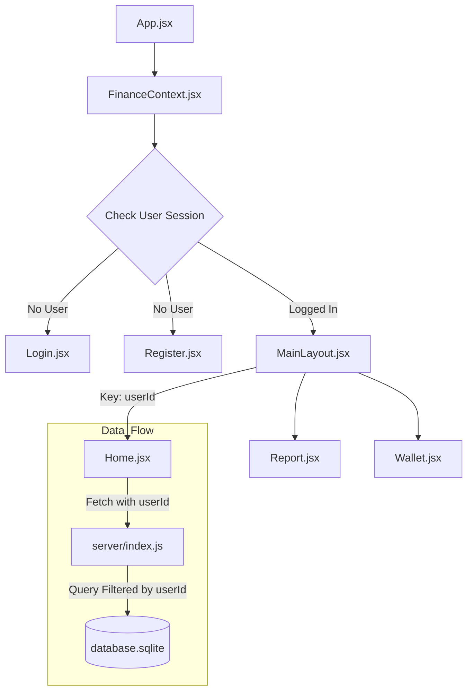

# Dokumentasi Program FinKu (Daily Financial Tracker)

File ini berisi panduan teknis mengenai struktur program, hubungan antar file, dan fungsi-fungsi penting untuk mengatur tampilan.

---

## 1. Daftar Fungsi Pengaturan Tampilan (Styling & Formatting)

Berikut adalah fungsi-fungsi utama yang digunakan untuk mempercantik dan memformat data di UI:

| Fungsi / Variabel | Lokasi | Kegunaan |
| :--- | :--- | :--- |
| `toLocaleString('id-ID')` | Berbagai file | Memformat angka menjadi format mata uang Rupiah (contoh: Rp 1.000.000). |
| `iconMap` | `Wallet.jsx` | Memetakan nama string (misal: 'CreditCard') ke komponen ikon `lucide-react`. |
| `colorOptions` | `AddWalletModal.jsx` | Daftar kode warna hex premium untuk kustomisasi warna dompet. |
| `ResponsiveContainer` | `Home.jsx` | Komponen dari `recharts` agar grafik otomatis menyesuaikan ukuran layar. |
| `isThisMonth()` | `FinanceContext.jsx` | Helper untuk menyaring transaksi yang terjadi hanya pada bulan berjalan. |
| `API_BASE` | `FinanceContext.jsx` | Alamat server API yang bersifat dinamis (`window.location.hostname`) untuk mendukung akses lintas perangkat. |
| `Cache Busting (_=ts)` | `FinanceContext.jsx` | Penambahan parameter timestamp pada URL API untuk mencegah browser menampilkan data lama (stale) saat ganti akun. |
| `login()` & `logout()` | `FinanceContext.jsx` | Fungsi untuk mengelola sesi pengguna dan membersihkan data state secara instan saat keluar. |
| `key={user?.id}` | `MainLayout.jsx` | Teknik React untuk memaksa komponen *re-mount* total saat ganti akun, memastikan tidak ada data akun lama yang tersisa di UI. |

---

## 2. Sistem Desain & Autentikasi

Aplikasi ini sekarang mendukung **Multi-User** dengan sistem keamanan database.

### A. Fitur Autentikasi
1.  **Register**: Pengguna mendaftar dengan Nama Panggilan, Email, dan Kata Sandi. Secara otomatis mendapatkan 3 dompet default (BCA, Tunai, GoPay) yang bersifat privat.
2.  **Login**: Verifikasi kredensial dan penyimpanan sesi aman di `localStorage` (`tera_user`).
3.  **Data Isolation**: Setiap data transaksi dan dompet dikunci menggunakan `userId`. Pengguna A tidak bisa melihat atau meriset data Pengguna B.

### B. Palet Warna (Theme Colors)
Warna didefinisikan di `index.css` dan bisa dipanggil dengan class `text-{nama}` atau `bg-{nama}`.

| Nama Warna | Kode Hex | Penggunaan Utama |
| :--- | :--- | :--- |
| `primary` | `#0f172a` | Warna utama (Biru Gelap), Header, Tombol Utama. |
| `success` | `#10b981` | Pemasukan, Tombol Simpan, Status Positif. |
| `danger` | `#ef4444` | Pengeluaran, Pesan Error, Tombol Hapus. |
| `background` | `#f8fafc` | Latar belakang seluruh halaman (Abu-abu sangat muda). |
| `surface` | `#ffffff` | Warna kartu (Card), Input, Modal (Putih Bersih). |
| `textMuted` | `#64748b` | Teks keterangan atau placeholder (Abu-abu). |

---

## 3. Struktur Sambungan Antar File (Architecture)

Aplikasi ini menggunakan pola **Provider-Consumer** dengan React Context API dan sistem Autentikasi.

## 4. Arsitektur & Teknologi Stack (Tech Stack)

Aplikasi ini menggunakan arsitektur modern berbasis JavaScript dengan pemisahan Frontend dan Backend yang terhubung melalui API:

### A. Frontend (Tampilan)
*   **React 19 & Vite**: Library utama untuk membangun antarmuka pengguna yang cepat dan efisien.
*   **Tailwind CSS 4**: Framework CSS untuk desain yang responsif, modern, dan premium tanpa menulis banyak file CSS manual.
*   **Context API**: Digunakan untuk manajemen state global (seperti data user, saldo, dan transaksi) tanpa perlu library tambahan seperti Redux.
*   **Recharts**: Library khusus untuk menampilkan grafik statistik keuangan di halaman Dashboard.
*   **Lucide React**: Koleksi ikon minimalis dan premium yang digunakan di seluruh navigasi dan kategori.
*   **React Router 7**: Mengatur navigasi antar halaman tanpa perlu memuat ulang browser (Single Page Application).

### B. Backend (Server)
*   **Node.js & Express**: Lingkungan server yang menangani permintaan (request) dari frontend, seperti login, daftar, dan simpan transaksi.
*   **RESTful API**: Protokol komunikasi standar untuk pertukaran data dalam format JSON.
*   **Concurrently**: Memungkinkan server dan tampilan aplikasi berjalan secara bersamaan dalam satu perintah (`npm run dev`).

### C. Database (Penyimpanan Data)
*   **SQLite3**: Database SQL yang efisien dan disimpan dalam satu file (`database.sqlite`). Sangat cocok untuk aplikasi tracker karena ringan namun mendukung relasi data yang kompleks (Foreign Keys).
*   **Data Isolation Logic**: Setiap record data (Dompet & Transaksi) memiliki kolom `userId` untuk menjamin keamanan dan privasi data antar pengguna.

---

## 5. Penjelasan Fungsi Setiap File Program

### Frontend (`/src`)

*   **`pages/Login.jsx` [NEW]**: Halaman masuk utama dengan integrasi API dan penanganan error koneksi server.
*   **`pages/Register.jsx` [NEW]**: Halaman pendaftaran akun baru dengan fitur pembuatan dompet default otomatis untuk tiap user baru.
*   **`context/FinanceContext.jsx`**: "Otak" aplikasi. Sekarang mengelola `user` state, sinkronisasi sesi, dan isolasi data antar user.
*   **`layouts/MainLayout.jsx`**: Template utama. Sekarang menggunakan `key={user?.id}` untuk menjamin kebersihan data saat ganti akun.
*   **`pages/Home.jsx`**: Dashboard utama. Menampilkan greeting personal **"Hai, [Nickname]"** dan ringkasan finansial privat.
*   **`pages/Report.jsx`**: Laporan interaktif. Dilengkapi fitur **Toggle Pemasukan/Pengeluaran** untuk melihat rincian kategori yang berbeda.

### Backend (`/server`)

*   **`server/index.js`**: Server Express. Sekarang mendukung endpoint `/api/login`, `/api/register`, dan proteksi data berbasis `userId`.
*   **`server/db.js`**: Database SQLite. Mengelola 3 tabel utama: `users`, `wallets`, dan `transactions` dengan relasi kunci tamu (Foreign Key).

---

## 6. Skema Database (Data Schema)

Aplikasi menggunakan 3 tabel yang saling berhubungan:

1.  **`users`**: Menyimpan identitas akun (`nickname`, `email`, `password`).
2.  **`wallets`**: Menyimpan data dompet. Memiliki kolom `userId` untuk memastikan dompet hanya muncul bagi pemiliknya.
3.  **`transactions`**: Menyimpan riwayat uang. Terhubung ke `walletId` dan `userId` untuk isolasi data total.

---

## 7. Log Perkembangan & Fitur Unggulan (Progress Report)

Berikut adalah status terakhir perkembangan fitur aplikasi FinKu:

| Fitur | Status | Deskripsi |
| :--- | :--- | :--- |
| **Multi-User Auth** | ✅ Selesai | Sistem Register & Login dengan enkripsi session di localStorage dan database. |
| **Data Isolation** | ✅ Selesai | Tiap akun memiliki data transaksi dan dompet sendiri. Tidak ada data yang tercampur antar user. |
| **Personal Greeting** | ✅ Selesai | Dashboard menampilkan nama panggilan pengguna secara dinamis ("Hai, Nickname"). |
| **Toggle Laporan** | ✅ Selesai | Halaman laporan bisa berganti antara grafik Pemasukan dan Pengeluaran dengan satu klik. |
| **Auto-Wallet Creation** | ✅ Selesai | User baru otomatis mendapatkan 3 dompet default (BCA, Tunai, GoPay) saat pendaftaran. |
| **Cross-Device API** | ✅ Selesai | Menggunakan `window.location.hostname` agar server bisa diakses dari HP atau Laptop lain di jaringan yang sama. |

---

*Catatan: Dokumentasi ini diperbarui secara berkala seiring dengan penambahan fitur keamanan dan fungsionalitas baru.*
